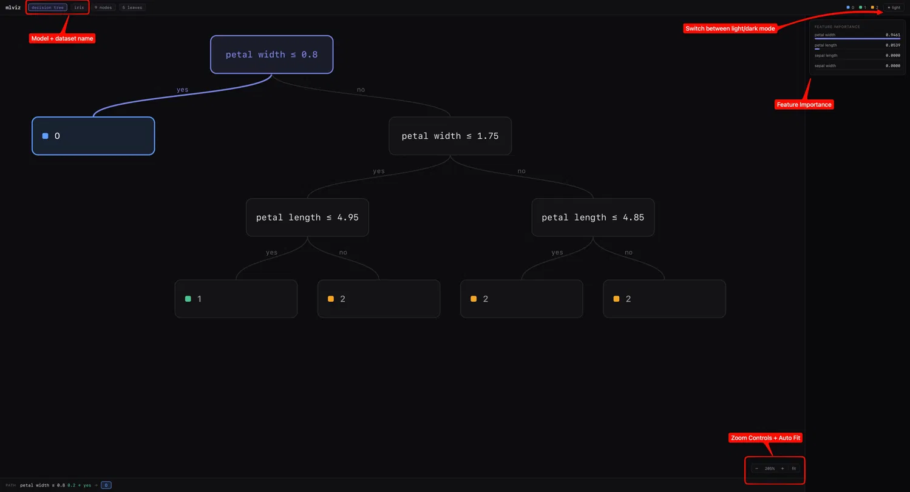
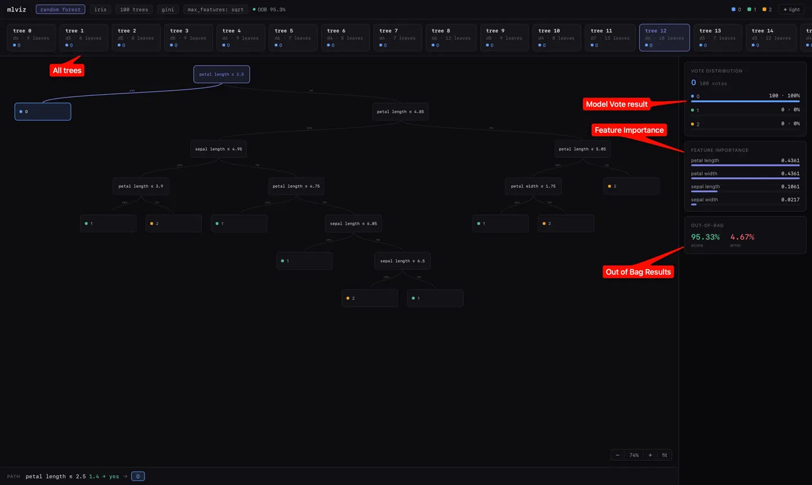
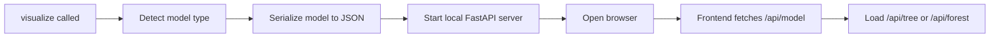

<div align="center">

# mlviz — ML Model Visualizer

[](https://opensource.org/licenses/MIT)
[](https://www.python.org/)
[](https://scikit-learn.org/)

**Pass a trained sklearn model. Get an interactive browser viewer showing exactly how it makes decisions.**

[What it shows](#what-it-shows) • [Quick start](#quick-start) • [API](#api) • [How it works](#how-it-works) • [Development](#development-setup) • [Roadmap](#roadmap)

</div>

---

## Overview

`mlviz` takes a fitted scikit-learn model, starts a local server, and opens a browser UI so you can inspect the model structure interactively.

- You see the **real model** — not a diagram generated from scratch, but the actual fitted tree structure
- Pass a **query point** and mlviz traces the exact path that sample takes through the model
- Supports **Decision Trees** and **Random Forests** today

---

## What it shows

### Decision Tree



- Full tree layout with every split and leaf node
- Highlighted decision path for a query point
- Hover tooltips on each node
- Feature importance sidebar
- Zoom controls with auto-fit

### Random Forest



- Tree browser strip — scroll and click to inspect individual trees
- Single-tree canvas with path highlighting
- Ensemble vote distribution panel
- Feature importance sidebar
- OOB score card (when `oob_score=True` was set on the model)

Both views support a **light/dark theme toggle** with saved preference.

---

## Quick start

### Decision Tree

```python
from sklearn.datasets import load_iris
from sklearn.tree import DecisionTreeClassifier
from mlviz import visualize

iris = load_iris()
X, y = iris.data, iris.target

model = DecisionTreeClassifier(max_depth=3, random_state=0)
model.fit(X, y)

visualize(
    model,
    X,
    y,
    query=X[0],
    feature_names=iris.feature_names,
    dataset_name="iris",
)
```

### Random Forest

```python
from sklearn.datasets import load_breast_cancer
from sklearn.ensemble import RandomForestClassifier
from mlviz import visualize

breast = load_breast_cancer()
X, y = breast.data, breast.target

model = RandomForestClassifier(n_estimators=100, random_state=0, oob_score=True)
model.fit(X, y)

visualize(
    model,
    X,
    y,
    query=X[0],
    feature_names=breast.feature_names,
    dataset_name="breast cancer",
)
```

Both examples are in `demo.ipynb` alongside a wine dataset example.

---

## API

```python
visualize(
    model,
    X_train,
    y_train,
    query=None,
    feature_names=None,
    dataset_name=None,
)
```

| Parameter | Type | Description |
|---|---|---|
| `model` | fitted estimator | `DecisionTreeClassifier` or `RandomForestClassifier` |
| `X_train` | array-like | Training features used to fit the model |
| `y_train` | array-like | Training labels used to fit the model |
| `query` | array-like, optional | A single sample to trace through the model |
| `feature_names` | list, optional | Feature names for display. DataFrame column names also work |
| `dataset_name` | str, optional | Label shown in the header and browser tab title |

---

## How it works



1. `visualize()` detects whether the model is a Decision Tree or Random Forest
2. The fitted model is serialized into a JSON payload the frontend can render
3. A FastAPI server starts on a random free port and the browser opens automatically

The tree canvas renderer is shared between both views — the surrounding UI adapts per model type.

---

## Project structure

```
mlviz/
├── __init__.py
├── extractors/
│   ├── decision_tree.py
│   ├── random_forest.py
│   └── shared.py
├── server/
│   └── app.py
└── frontend/
    ├── src/
    │   ├── App.jsx
    │   ├── MLVizTree.jsx
    │   ├── theme.js
    │   ├── components/
    │   └── views/
    │       ├── DecisionTreeView.jsx
    │       └── RandomForestView.jsx
    └── dist/

tests/
├── test_decision_tree_extractor.py
├── test_random_forest_extractor.py
├── test_server.py
└── test_visualize.py
```

---

## Development setup

### Prerequisites

| Tool | Version | Notes |
|---|---|---|
| Python | 3.10+ | tested on 3.10.20 |
| Node.js | 18+ | tested on v26 |

---

### 1. Clone the repo

```bash
git clone https://github.com/NicGroenewald/ML-visualizer.git
cd ML-visualizer
```

---

### 2. Set up a Python environment

Pick one path. **Conda is recommended** — it handles numpy/scikit-learn native dependencies cleanly and registers automatically as a Jupyter kernel in VS Code.

#### Option A — conda (recommended)

```bash
conda create -n mlvis python=3.10
conda activate mlvis
pip install -r requirements.txt
pip install -e .
```

The `mlvis` kernel appears automatically in VS Code's kernel picker — no extra steps needed.

#### Option B — venv (Mac/Linux)

```bash
python -m venv mlvis-env
source mlvis-env/bin/activate
pip install -r requirements.txt
pip install -e .
```

#### Option C — venv (Windows)

```bash
python -m venv mlvis-env
mlvis-env\Scripts\activate
pip install -r requirements.txt
pip install -e .
```

> **Tip (venv only):** If you see `BackendUnavailable: Cannot import 'setuptools.backends.legacy'` during `pip install -e .`, run `pip install setuptools` first, then retry.

#### Jupyter kernel registration (venv only)

Unlike conda, venv environments don't register themselves as Jupyter kernels automatically. `ipykernel` is already installed by `pip install -r requirements.txt`.

**Step 1** - Register the kernel:

```bash
python -m ipykernel install --user --name=mlvis-env --display-name "mlvis-env"
```

**Step 2** - Reload VS Code: `Ctrl+Shift+P` → **Developer: Reload Window** (the Jupyter extension caches the kernel list and won't pick up the new kernel until the window refreshes).

**Step 3** - Open `demo.ipynb`. Click the kernel picker in the top-right → **Select Another Kernel** → **Python Environments** → select `mlvis-env`.

> If `mlvis-env` doesn't appear under **Python Environments**, try: kernel picker → **Select Another Kernel** → **Jupyter Kernel** → select `mlvis-env` instead.

---

### 3. Install frontend dependencies

```bash
cd mlviz/frontend
npm install
```

---

### 4. Run the test suite

```bash
pytest tests/ -v
```

---

### 5. Frontend development (hot reload)

Two terminals:

**Terminal 1 — Python API server** (fixed port 8765, serves iris test data):
```bash
python dev_server.py
```

**Terminal 2 — Vite dev server**:
```bash
cd mlviz/frontend
npm run dev
```

Open the URL Vite prints (usually `http://localhost:5173`). The Vite config proxies `/api/*` to the Python server so the frontend works against live model data with hot reload.

---

### 6. Build the frontend bundle

Run before committing any frontend changes. The built `dist/` ships with the Python package and must stay in sync with `src/`.

```bash
cd mlviz/frontend && npm run build
```

### 7. Test run

Two options to verify everything is working end-to-end:

**Option A — demo notebook**

Open `demo.ipynb` in Jupyter. It contains ready-to-run cells for both supported model types (Decision Tree on iris, Random Forest on breast cancer) with query-path tracing enabled. Run all cells and a browser tab should open for each.

**Option B — write your own**

Follow the examples in [Quick start](#quick-start) to fit a model and call `visualize()`. Any `DecisionTreeClassifier` or `RandomForestClassifier` from scikit-learn will work.

> **Note:** When running `visualize()` from a plain `.py` script, the terminal stays open with `mlviz serving at http://... - press Ctrl+C to stop`. This is expected - the server keeps the browser tab live until you stop it. Running from a Jupyter notebook returns control to the cell immediately.

---

## Roadmap

Currently supported:
- Decision Tree visualisation
- Random Forest visualisation
- Query-path tracing
- Feature importance display
- Light/dark theme toggle
- Dataset naming

Planned:
- KNN
- SVM
- More explanation layers aimed at understanding model behaviour
- Better tree browser for large forests

---

## Known limitations

- Only `DecisionTreeClassifier` and `RandomForestClassifier` are supported right now
- Very large forests will need a smarter tree browser than the current flat strip
- Light mode still needs a contrast pass on the tree canvas

---

## License

MIT
