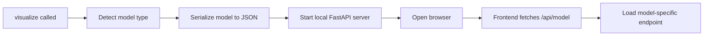

<div align="center">

# mlviz — ML Model Visualizer

[](https://opensource.org/licenses/MIT)
[](https://www.python.org/)
[](https://scikit-learn.org/)

**Pass a trained sklearn model. Get an interactive browser viewer showing exactly how it makes decisions.**

[What it shows](#what-it-shows) • [Quick start](#quick-start) • [API](#api) • [How it works](#how-it-works) • [Development](#development-setup) • [Roadmap](#roadmap)

</div>

---

## Overview

`mlviz` takes a fitted scikit-learn model, starts a local server, and opens a browser UI so you can inspect the model structure interactively. It is two halves shipped as one pip package:

| | |
|---|---|
| **Python library** | `visualize(model, X, y)` detects the estimator type, serializes the fitted model to JSON, and starts a FastAPI server on a free port. |
| **React frontend** | A single-page app (React 18 + Vite + Framer Motion) that fetches that JSON and renders a model-appropriate view — pan/zoom SVG tree canvas, ensemble panels, neighbor tables, PCA projection plots, light/dark theming. |

The frontend is built ahead of time and the compiled bundle (`mlviz/frontend/dist/`) is committed to the repo, so the Python package ships with the UI inside it. **You do not need Node.js to use mlviz — only to develop the frontend.** By line count the repo is roughly half JavaScript/JSX.

- You see the **real model** — not a diagram generated from scratch, but the actual fitted tree structure
- Pass a **query point** and mlviz traces the exact path that sample takes through the model
- Supports **Decision Trees**, **Random Forests**, **KNN**, and **SVM** for classification and regression today
- A **pytest suite** under `tests/` covers every extractor, the server routes, and the `visualize()` dispatch

---

## What it shows

### Decision Tree


- Full tree layout with every split and leaf node
- Highlighted decision path for a query point
- Hover tooltips on each node
- Feature importance sidebar
- Zoom controls with auto-fit

### Random Forest


- Tree browser strip — scroll and click to inspect individual trees
- Single-tree canvas with path highlighting
- Ensemble vote distribution or prediction spread panel
- Feature importance sidebar
- OOB score card (when `oob_score=True` was set on the model)

Both views support a **light/dark theme toggle** with saved preference.

### KNN and SVM

- KNN summary view with nearest-neighbor distances, labels/targets, and effective weights for a query point
- SVM summary view with support vectors, kernel parameters, and query prediction details
- SVG query explanation charts and PCA projection plots for non-tree model behavior
- Classification and regression modes use the same `task_type` convention as the tree views

---

## Quick start

### Decision Tree Classifier

```python
from sklearn.datasets import load_iris
from sklearn.tree import DecisionTreeClassifier
from mlviz import visualize

iris = load_iris()
X, y = iris.data, iris.target

model = DecisionTreeClassifier(max_depth=3, random_state=0)
model.fit(X, y)

visualize(
    model,
    X,
    y,
    query=X[0],
    feature_names=iris.feature_names,
    dataset_name="iris",
)
```

### Decision Tree Regressor

```python
from sklearn.datasets import load_diabetes
from sklearn.tree import DecisionTreeRegressor
from mlviz import visualize

diabetes = load_diabetes()
X, y = diabetes.data, diabetes.target

model = DecisionTreeRegressor(max_depth=3, random_state=0)
model.fit(X, y)

visualize(
    model,
    X,
    y,
    query=X[0],
    feature_names=diabetes.feature_names,
    dataset_name="diabetes",
)
```

### Random Forest Classifier

```python
from sklearn.datasets import load_breast_cancer
from sklearn.ensemble import RandomForestClassifier
from mlviz import visualize

breast = load_breast_cancer()
X, y = breast.data, breast.target

model = RandomForestClassifier(n_estimators=100, random_state=0, oob_score=True)
model.fit(X, y)

visualize(
    model,
    X,
    y,
    query=X[0],
    feature_names=breast.feature_names,
    dataset_name="breast cancer",
)
```

### Random Forest Regressor

```python
from sklearn.datasets import load_diabetes
from sklearn.ensemble import RandomForestRegressor
from mlviz import visualize

diabetes = load_diabetes()
X, y = diabetes.data, diabetes.target

model = RandomForestRegressor(n_estimators=100, random_state=0, oob_score=True)
model.fit(X, y)

visualize(
    model,
    X,
    y,
    query=X[0],
    feature_names=diabetes.feature_names,
    dataset_name="diabetes",
)
```

### KNN Classifier

```python
from sklearn.datasets import load_iris
from sklearn.neighbors import KNeighborsClassifier
from mlviz import visualize

iris = load_iris()
X, y = iris.data, iris.target

model = KNeighborsClassifier(n_neighbors=5, weights="distance")
model.fit(X, y)

visualize(
    model,
    X,
    y,
    query=X[0],
    feature_names=iris.feature_names,
    dataset_name="iris knn",
)
```

### SVM Classifier

```python
from sklearn.datasets import load_iris
from sklearn.svm import SVC
from mlviz import visualize

iris = load_iris()
X, y = iris.data, iris.target

model = SVC(kernel="rbf", probability=True, random_state=0)
model.fit(X, y)

visualize(
    model,
    X,
    y,
    query=X[0],
    feature_names=iris.feature_names,
    dataset_name="iris svm",
)
```

The full set of standalone examples is in `demo.ipynb`.

---

## API

```python
visualize(
    model,
    X_train,
    y_train,
    query=None,
    feature_names=None,
    dataset_name=None,
)
```

| Parameter | Type | Description |
|---|---|---|
| `model` | fitted estimator | `DecisionTreeClassifier`, `DecisionTreeRegressor`, `RandomForestClassifier`, `RandomForestRegressor`, `KNeighborsClassifier`, `KNeighborsRegressor`, `SVC`, or `SVR` |
| `X_train` | array-like | Training features used to fit the model |
| `y_train` | array-like | Training labels used to fit the model |
| `query` | array-like, optional | A single sample to trace through the model |
| `feature_names` | list, optional | Feature names for display. DataFrame column names also work |
| `dataset_name` | str, optional | Label shown in the header and browser tab title |

---

## How it works



1. `visualize()` detects whether the model is a Decision Tree, Random Forest, KNN, or SVM, and whether it is classification or regression
2. The fitted model is serialized into a JSON payload the frontend can render
3. A FastAPI server starts on a random free port and the browser opens automatically

Tree-based views share the tree canvas renderer. KNN and SVM use compact summary/table views plus SVG PCA projection plots built from structured backend data.

---

## Project structure

Two codebases in one repo: a Python package that extracts and serves model data, and a React app that renders it.

### Python — extract and serve

```
mlviz/
├── __init__.py                     # visualize() entry point + model-type dispatch
├── extractors/                     # fitted sklearn model → JSON payload
│   ├── shared.py                   #   tree-walking helpers shared by DT and RF
│   ├── decision_tree.py            #   /api/tree
│   ├── random_forest.py            #   /api/forest
│   ├── knn.py                      #   /api/knn
│   └── svm.py                      #   /api/svm
└── server/
    └── app.py                      # FastAPI: model endpoint + /api/model manifest,
                                    # and mounts frontend/dist/ as static files

dev_server.py                       # frontend dev helper: FastAPI on :8765 with iris data
requirements.txt                    # pinned runtime + test dependencies
pyproject.toml                      # packaging metadata
demo.ipynb                          # runnable examples for every supported model family
```

### React — the frontend

```
mlviz/frontend/
├── package.json                    # scripts: dev / build / preview
├── vite.config.js                  # build → dist/, dev-server proxy /api → :8765
├── src/
│   ├── main.jsx                    # React root
│   ├── App.jsx                     # fetches /api/model, routes by model_type, theme state
│   ├── theme.js                    # design tokens (dark/light palettes, class colours, fonts)
│   ├── index.css                   # global resets, scrollbars, keyframes
│   ├── MLVizTree.jsx               # model-agnostic single-tree SVG canvas renderer
│   ├── views/                      # one view per model type, each owns its own chrome
│   │   ├── DecisionTreeView.jsx
│   │   ├── RandomForestView.jsx
│   │   ├── KnnView.jsx
│   │   └── SvmView.jsx
│   └── components/
│       ├── AppHeader.jsx           # shared header shell (wordmark, pills, legend, toggle)
│       ├── forest/                 # ForestHeader, ForestTreeBrowser, Panel,
│       │                           # FeatureImportancePanel, VoteDistributionPanel,
│       │                           # PredictionDistributionPanel, OobMetricCard
│       └── nonTree/                # NonTreeVisuals — SVG charts + PCA projection plots
└── dist/                           # built bundle — COMMITTED, ships inside the pip package.
                                    # Rebuild with `npm run build` after any src/ change.
```

### Tests

```
tests/
├── test_decision_tree_extractor.py
├── test_random_forest_extractor.py
├── test_knn_extractor.py
├── test_svm_extractor.py
├── test_server.py                  # FastAPI TestClient against the routes
└── test_visualize.py               # model-type dispatch
```

Run them with `pytest tests/ -v`.

---

## Development setup

### Prerequisites

- **Python 3.10–3.12.** Not 3.13+ — `requirements.txt` pins `numpy==2.0.1`, which only publishes
  wheels up to CPython 3.12. On a newer interpreter pip falls back to building numpy from source
  and the compile fails. If `python3 --version` reports 3.13 or later, create the environment
  against an older interpreter explicitly (the conda path below does this for you).
- Node.js + npm — **only if you intend to modify the React frontend**
- Git

**Notes**
- `venv` setup works well for running your own `.py` scripts. → [Venv setup](#1-venv-setup-for-py)
- For `.ipynb` files such as `demo.ipynb`, use conda. → [Conda setup](#2-conda-setup-best-for-both-py-and-ipynb-files)
- Node.js is only needed if you intend to change the React frontend. → [Frontend development](#contributing--frontend-development)

---

### 1. Venv setup (for .py)

**1. Clone the repo**
```bash
git clone https://github.com/NicGroenewald/ML-visualizer.git
cd ML-visualizer
```

**2. Set up a Python environment**

venv (Mac/Linux) — note macOS usually has no bare `python`, only `python3`. Check `python3 --version` is 3.10–3.12 first:
```bash
python3 -m venv mlvis-env
source mlvis-env/bin/activate
pip install -r requirements.txt
pip install -e .
```

venv (Windows):
```bash
python -m venv mlvis-env
mlvis-env\Scripts\activate
pip install -r requirements.txt
pip install -e .
```

> **Tip:** If you see `BackendUnavailable: Cannot import 'setuptools.backends.legacy'` during `pip install -e .`, run `pip install setuptools` first, then retry.

**3. Run the test suite**
```bash
pytest tests/ -v
```

Expect `59 passed`. Warnings from sklearn's PCA and OOB estimator are normal.

**4. Test run**

Write your own `.py` file using the examples in [Quick start](#quick-start) to fit a model and call `visualize()`. Any supported Decision Tree, Random Forest, KNN, or SVM classifier/regressor from scikit-learn will work.

> **Note:** When running `visualize()` from a plain `.py` script, the terminal stays open with `mlviz serving at http://... — press Ctrl+C to stop`. This is expected — the server keeps the browser tab live until you stop it.

---

### 2. Conda setup (recommended — works for both `.py` and `.ipynb`)

Ensure you have conda installed from https://www.anaconda.com/download

**1. Clone the repo**
```bash
git clone https://github.com/NicGroenewald/ML-visualizer.git
cd ML-visualizer
```

**2. Set up a Python environment**
```bash
conda create -n mlvis python=3.10
conda activate mlvis
pip install -r requirements.txt
pip install -e .
```

> Recommended path. Pinning `python=3.10` at create time sidesteps the numpy-wheel problem above
> regardless of which interpreter your system `python3` points at, and it gives the smoothest
> experience with Jupyter notebooks and `demo.ipynb`.

**3. Run the test suite**
```bash
pytest tests/ -v
```

Expect `59 passed`. Warnings from sklearn's PCA and OOB estimator are normal.

**4. Notebook / demo run**

Open `demo.ipynb` in VS Code or Jupyter and select the `mlvis` conda environment as the notebook kernel. Then run the notebook cells to launch the visualizer.

---

### Contributing / Frontend development

Only needed if you're modifying the React frontend. Requires Node.js + npm.

**How the frontend reaches the browser:** `server/app.py` mounts `mlviz/frontend/dist/` as static files — so what `visualize()` serves is the *built* bundle, never `src/`. Editing `src/` changes nothing until you rebuild.

**1. Install frontend dependencies**
```bash
cd mlviz/frontend
npm install
```

**2. Develop with hot reload**

Two terminals, **started in this order** — Vite's proxy has no retry, so if the Python server
isn't listening yet you get `http proxy error: connect ECONNREFUSED 127.0.0.1:8765` and blank data.

Terminal 1 — Python API server (fixed port 8765, serves iris test data). Wait for
`Uvicorn running on http://127.0.0.1:8765` before starting terminal 2:
```bash
python dev_server.py
```

Terminal 2 — Vite dev server:
```bash
cd mlviz/frontend
npm run dev
```

Open the URL Vite prints (usually `http://localhost:5173`). `vite.config.js` proxies `/api/*` to the Python server on `:8765`, so the frontend runs against live model data with hot reload.

**3. Rebuild `dist/` before committing**

`npm run build` is the script that regenerates `mlviz/frontend/dist/` (Vite writes it with `emptyOutDir: true`). Nothing else does — `npm run dev` serves from memory and `npm run preview` only re-serves an existing build.

```bash
cd mlviz/frontend && npm run build
```

`dist/` is committed to the repo on purpose, because it ships inside the pip package. A commit that changes `src/` without a matching rebuilt `dist/` will look correct in dev and be stale for everyone who installs it.

---

## Roadmap

Currently supported:
- Decision Tree classification and regression visualisation
- Random Forest classification and regression visualisation
- KNN classification and regression summaries with query neighbor details
- SVM classification and regression summaries with support-vector details
- SVG query explanation charts and PCA projection plots for KNN and SVM
- Query-path tracing
- Feature importance display
- Light/dark theme toggle
- Dataset naming

Planned:
- More explanation layers aimed at understanding model behaviour
- Better tree browser for large forests

---

## Known limitations

- Only single-output `DecisionTreeClassifier`, `DecisionTreeRegressor`, `RandomForestClassifier`, `RandomForestRegressor`, `KNeighborsClassifier`, `KNeighborsRegressor`, `SVC`, and `SVR` models are supported right now
- KNN and SVM projection plots are PCA-based approximations for visual inspection; predictions still use the original feature space
- Very large forests will need a smarter tree browser than the current flat strip
- Light mode still needs a contrast pass on the tree canvas

---

## License

MIT
